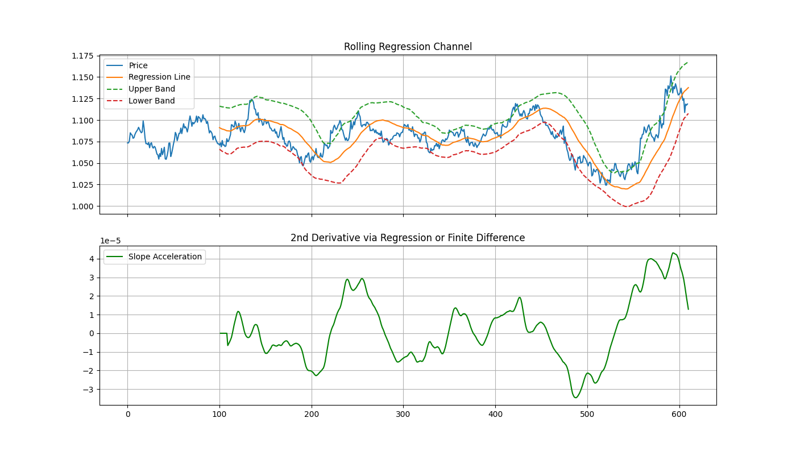

# Second-Order Derivative Regression

This script demonstrates a practical application of linear regression analysis to forecast price movement and anticipate momentum shifts in a time series.

We apply two layers of rolling linear regression:
1. A **100-candle rolling regression** to extract the **first-order derivative** (slope) of price — this represents the directional momentum.
2. A **10-candle rolling regression over the first derivative** to compute a **second-order derivative** — measuring the rate of change of that momentum.

---

### 🧠 Motivation

While many traders rely on standard indicators like MACD or RSI, this approach uses a second-order derivative of linear regression slopes, offering a more nuanced view of price behavior.

Because it’s not widely adopted in the retail space, this kind of feature engineering remains relatively unexplored, making it a candidate for generating alpha in machine learning pipelines or proprietary strategies where uniqueness matters.

---

### 🔍 Use Case

This technique is especially useful for:
- Time series forecasting
- Momentum-based signal engineering
- Detecting early **trend shifts** in quantitative trading strategies

---

### 📈 Output

- The original price series
- First-order derivative (slope of price)
- Second-order derivative (slope of slope)
- The most recent 100-candle regression line plotted and labeled
- Annotated insights showing how momentum strength is evolving

---

### 🧪 Example



---

### 📁 File Structure

```
second_order_derivative_regression/
├── second_order_derivative_regression.py  # Main script
├── sample_data.csv                        # Historical OHLCV data
├── regression_plot.png                    # Output plot with annotations
└── README.md                              # This file
```

---

> This project is part of a sandbox repository exploring quantitative methods. It is intended to demonstrate this concept in isolation; additional work is needed to integrate such features into a full trading system.
